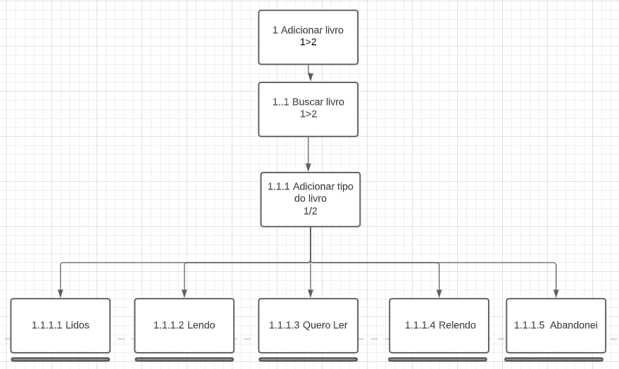
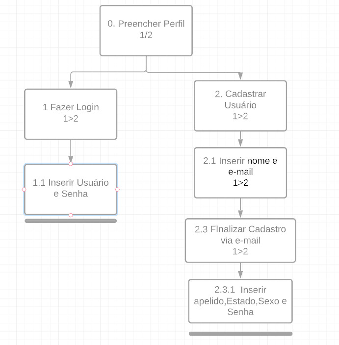

## Análise Hierárquica de Tarefas

A Análise Hierárquica de Tarefas (HTA – Hierarchical Task Analysis) foi desenvolvida na década de 1960 para entender as competências e habilidades exibidas em tarefas
complexas e não repetitivas, bem como para auxiliar na identificação de problemas de desempenho. Ela ajuda a relacionar o que as pessoas fazem (ou se recomenda que façam), por que o fazem, e quais as consequências caso não o façam corretamente. Ela se baseia em psicologia funcional, e não comportamental, como eram as abordagens da época em que foi criada.

## Introdução

&emsp;&emsp;A analise de tarefas em IHC é utilizada principalmente para buscar um maior entendimento sobre o trabalho dos usuários, como eles o realizam e o porquê. O trabalho então é organizado em objetivos que os usuários necessitam ou querem atingir, com o resultado do trabalho se busca definir um “desempenho satisfatório” para o sistema e seus componentes. Esta analise pode ocorrer em diferentes etapas do desenvolvimento do sistema, seja para uma analise de situação atual, um (re)design de um sistema ou para uma avaliação que inclua uma introdução de um novo sistema.

## HTA – Análise Hierárquica de tarefas

&emsp;&emsp;Desenvolvida na década de 1960, esta analise busca entender as competências e habilidades apresentadas em tarefas bem definidas e não repetitiva, busca também auxiliar na identificação de problemas de desempenho, já que o caminho das tarefas proposto deve ser um caminho ideal. É uma técnica que se baseia na psicológica funcional, buscando entender e relacionar o que as pessoas fazem, por que o fazem e quais as consequências caso não façam corretamente as tarefas.

&emsp;&emsp;A HTA começa pela definindo um objetivo principal a ser atingido, sendo este um estado final ou especifico de passos, pode ser definido por um ou mais eventos ou por valores fisicamente observáveis de uma ou mais variáveis que atuam como critério para alcance desse objetivo.

&emsp;&emsp;Após a definição do objetivo de alto nível a HTA o decompõe em subobjetivos, que vão auxiliar a identificar quais os pontos de maior dificuldade e que limitam o alcance ao objetivo maior, com os subobjetivos e as relações entre eles definidas, temos a criação de um plano. No plano podemos ter diferentes tipos de relação entre subobjetivos, que são: sequencial, seleção ou paralela, para cada subobjetivo ser alcançado, deve-se definir uma operação, que é a unidade fundamental do HTA. A figura a seguir apresenta os elementos de um diagrama HTA:

### Diagrama do objetivo adicionar livro:

#### (Figura 1) Diagrama do "objetivo adicionar livro",(Caio Vitor,2022)

### Representação em Tabela do objetivo adicioanar livro

| Objetivos/Operações | Problemas e Recomendações |
|---------------------|---------------------------|
| 1. Adicionar Livro |  |
| 1.1. Buscar livro| **Input**: barra de pesquisa   **Ação**: digitar o nome do livro que deseja buscar |
| 1.1.1 Adicionar tipo do livro| **Input**: barra de selecao do tipo de livro   **Ação**: clicar nas opções disponíveis|
| 1.1.1.1 Lidos|  **Ação:** clickar na opção se for esse tipo|
| 1.1.1.2 Lendo| **Ação:** clickar na opção se for esse tipo|
| 1.1.1.3 Quero ler|  **Ação:** clickar na opção se for esse tipo|
| 1.1.1.4 Relendo| **Ação:** clickar na opção se for esse tipo|
| 1.1.1.5 Abandonei|  **Ação:** clickar na opção se for esse tipo|

### Diagrama do objetivo cadastrar usuário:

#### (Figura 2) Diagrama do "objetivo cadastrar usuário",(Caio Vitor,2022)

### Representação em Tabela do objetivo cadastrar usuário

| Objetivos/Operações | Problemas e Recomendações |
|---------------------|---------------------------|
| 0. Preencher Perfil |  |
| 1 Fazer Login | **Plano**: escolher opção de login   **ação**: direciona pra opção escolhida |
| 1.1 Inserir Usuário e Senha | **Input**: campo de usuario   **Ação**: digitar e-mail e senha |
| 2. Cadastrar Usuário|**Ação**: escolher opção de login|
| 2.1 Inserir nome e e-mail | **Input**: campos de nome e-mail    **Ação**: inserir nome e e-mail do usuário|
| 2.3. Finalizar Cadastro via e-mail| **Plano**: Entrar no e-mail e confirmar cadastro   **Feedback:**: poderia deixar o usuário entrar com qualquer e-mail e só verificar depois de conseguir entrar no sistema  |
| 2.3.1 Inserir apelido,estado,Sexo e Senha | **Input**: campo com dados do usuário   **Ação**: digitar os dados do usuário   **Feedback**:alguns dados como estado são desnecessários já que o sistema não utiliza esse dado |

## Histórico de versão
| Versão | Data | Descrição  | Autor        | Revisor |
| :-----: | :----: | :----------: | :------------: | :--------: |
| 1.0 | 5/12/2022 | Analíse de Tarefas Hierarquicas | Caio Vitor, Hellen Fernanda | João Pedro Alves |