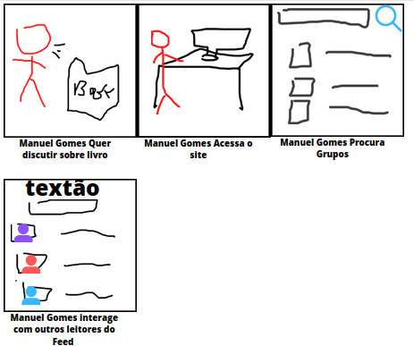
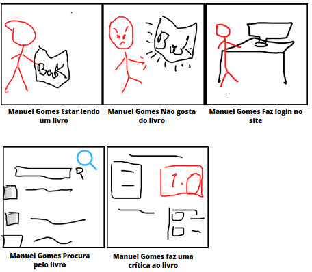
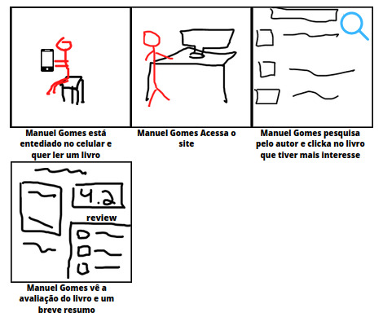

# Storyboard

## 1.Introdução

O Storyboard é uma representação de baixa fidelidade que pode ser definido como um rascunho ou esboço da interface, sem muita preocupação com detalhes dos aspectos gráficos e geralmente é feita manualmente com lápis e papel ou utilizando ferramentas computacionais.  
Esse desenvolvimento de protótipos iniciais e outras atividades realizadas ao longo de todo o processo de design fornecem insumos para o design final da interface e ajudam na identificação dos principais objetivos e cenários permitindo decidir quais elementos de interface devem ser destacados ou não.
Um storyboard deve ter:

- Pessoas envolvidas;
- Ambiente;
- Tarefa a ser feita;
- Passos para realizar a tarefa;
- O que motiva os usuários a usar o sistema.

## 2.Metodologia

Essa representação é um dos artefatos utilizados pelos designers para explorar ideias sobre como melhorar a prática de trabalho com o suporte oferecido pela tecnologia. Consiste em uma série de telas mostrando como o usuário pode progredir em uma tarefa no sistema.
Para o desenvolvimento do nosso Storyboard a equipe baseou-se nas [Personas](https://interacao-humano-computador.github.io/2022.2-Skoob/analise-de-requisitos/personas/) criadas anteriormente e em situações de uso do site. Assim podemos explicar visualmente as funcionalidades para facilitar no entendimento dos Requisitos necessários ou não para o site.

## 3.Storyboards individuais

### SB01 - Compartilhar opiões sobre livros

<figcaption align="center">Tabela 1 - Compartilhar opiões sobre livros, Fonte(Caio Vitor, 2022)</figcaption>

### SB02 - Fazer avaliação sobre um livro

<figcaption align="center">Tabela 2 - Fazer avaliação sobre um livro, Fonte(Caio Vitor, 2022)</figcaption>

### SB03 - Buscar livro para ler com base nas avaliações

<figcaption align="center">Tabela 3 - Buscar livro para ler com base nas avaliações, Fonte(Caio Vitor, 2022)</figcaption>

## 4.Conclusão

Espera-se que com a leitura desse documento, todos os membros da equipe e interessados compreendam as dores dos usuários, os cenários onde as ações do Skoob podem ser necessárias, as pessoas envolvidas e as atividades relacionadas.

Espera-se que com base nas informações contidas nesse documento, os designers possam desenvolver uma interface que possibilite melhores interações entre o sistema do Skoob e seus usuários.

## 5. Referências
> Sommerville, Ian. Engenharia de Software. 9a Edição. Pearson.

> BARBOSA, Simone; DINIZ, Bruno. Interação Humano-Computador, Editora Elsevier, Rio de Janeiro, 2010.

## Histórico de versão

| Versão |    Data    |                                    Descrição                                    | Autor  |  Revisor   |
| :----: | :--------: | :-----------------------------------------------------------------------------: | :----: | :--------: |
|  1.0   | 13/11/2022 | Criação do Documento. |João Pedro, Caio | Lucas |