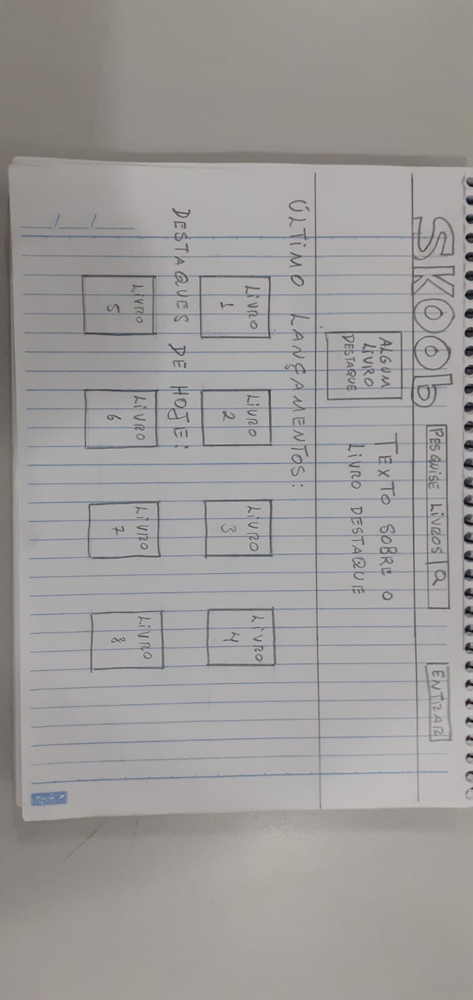
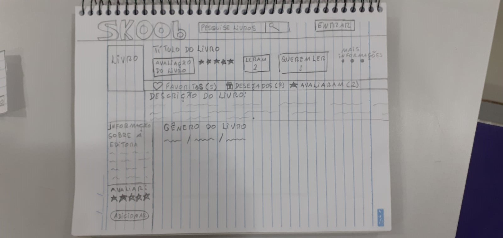
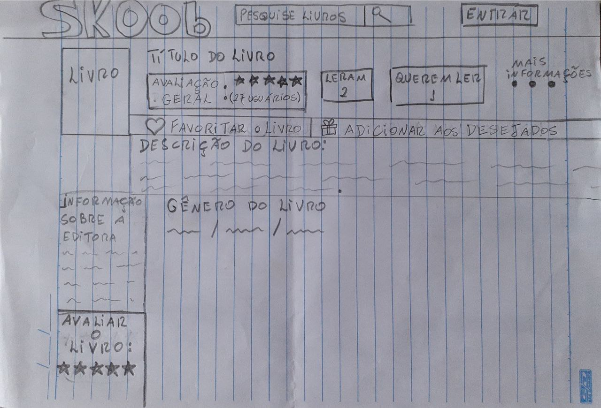
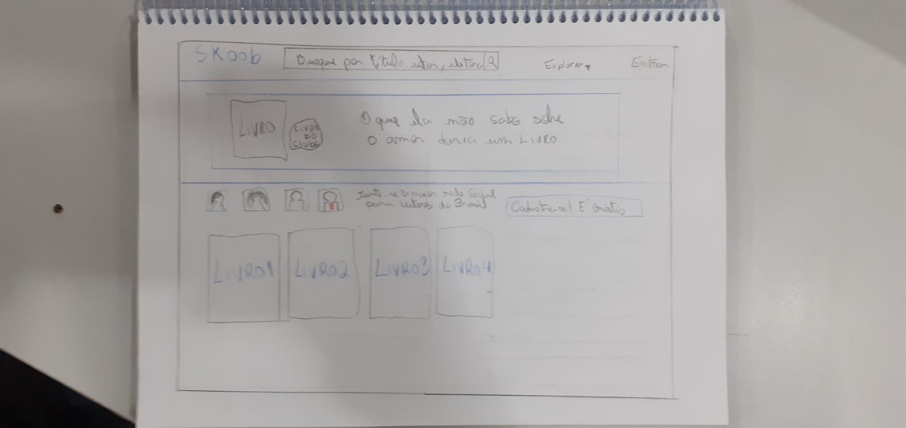

# Planejamento da avaliação - Protótipo de Papel

## Introdução

Elaborar um protótipo de papel é interessante pelo fato que de, muitas vezes, você que trabalha com design acaba gastando muito tempo e esforço para confeccionar um protótipo muito bem elaborado com uma ferramenta dinâmica para prototipagem. Porém, ao entregar para os interessados no produto, ocorre de ter que fazer diversas modificações no seu protótipo e evitar retrabalho é sempre o ideal. Segundo (Barbosa, 2021), utilizar o protótipo em papel é um modo rápido e com custos baixos de identificar problemas de usabilidade.

## Objetivo

O objetivo deste documento é planejar de forma detalhada as tarefas que serão realizadas na avaliação do protótipo de papel do site Skoob.

## Metodologia

A metodologia selecionada, após análise, foi a entrevista. Utilizando-se dessa técnica, planeja-se que o avaliador instrua o usuário na entrevista para a realização das tarefas, assim como na execução do planejamento.

Também optamos por adotar o framework DECIDE, que propõem orientar o planejamento, a execução e a análise de uma avaliação de IHC. As atividades do framework são interligadas e executadas interativamente, à medida que o avaliador articula os objetivos da avaliação, os dados e recursos disponíveis (Preece et al., 2002).

O acrônimo DECIDE pode ser expandido para os seguintes tópicos:

- **D**: Determinar os objetivos gerais da avaliação e identificar por que e para quem tais objetivos são importantes.
- **E**: Explorar perguntas a serem respondidas com a avaliação.
- **C**: Escolher (Choose) os métodos de avaliação a serem utilizados.
- **I**: Identificar e administrar as questões práticas da avaliação.
- **D**: Decidir como lidar com as questões éticas.
- **E**: Avaliar (Evaluate), interpretar e apresentar os dados.

## Planejamento da Avaliação

### Objetivo da Avaliação

A avaliação busca identificar possíveis problemas de usabilidade do site utilizando o protótipo de papel, bem como validar o protótipo ou se será necessário mudanças na ferramenta.

### Termo de Consentimento

O termo de consentimento é o documento que garante ao participante da pesquisa uma clara noção de como as suas informações serão usadas durante o decorrer do projeto, e também garante ao executores da pesquisa a aceitação clara do participante em fornecer as informações com os fins citados no documento.

 

**Termo de Consentimento Livre e Esclarecido**

Os objetivos desta pesquisa, e as informações que serão coletadas, estão relacionados somente com fins educativos, seguindo a Resolução N°466 do Conselho Nacional de Saúde, preservando o participante da pesquisa com todos os seus direitos éticos e humanitários listados na resolução, sempre seguindo os princípios da bioética que engloba os princípios da não maleficência, beneficência, da autonomia e da justiça.   

Os executores da pesquisa podem utilizar a voz, e/ou a imagem do participante caso nescessário, para a coleta de informações e/ou registro de atividades e reuniões, sempre seguindo a Resolução N°466 do Conselho Nacional de Saúde, preservando o participante da pesquisa com todos os seus direitos éticos e humanitários listados na resolução, sempre seguindo os princípios da bioética que engloba os princípios da não maleficência, beneficência, da autonomia e da justiça.    

Ao participar da pesquisa, você deve estar de acordo em fornecer as informações nescessárias para ajudar os executores do projeto 2022.2-Skoob, da matéria de Interação Humano-Computador da Universidade de Brasília, a alcançarem seus objetivos.

  

### Protótipo de Papel

 A <i>Figura 1</i>, <i>Figura 2</i>, <i>Figura 3</i>, <i>Figura 4</i> e <i>Figura 5</i> são uma demonstração dos protótipos de papel elaborado pela equipe, que será disponibilizado para o usuário durante a entrevista e analisado por ele.

<figcaption align='center'>Figura 1: Página home 1 (Fonte: Autores, 2022)</figcaption>
 

<figcaption align='center'>Figura 2: Página de um livro (Fonte: Autores, 2022)</figcaption>
 

<figcaption align='center'>Figura 3: Página de um livro versão 2.0 (Fonte: Autores, 2022)</figcaption>
 

<figcaption align='center'>Figura 4: Página de perfil 1 (Fonte: Autores, 2022)</figcaption>
 

<figcaption align='center'>Figura 5: Página home 2 (Fonte: Autores, 2022)</figcaption>
 

<figcaption align='center'>Figura 6: Página de perfil 2 (Fonte: Autores, 2022)</figcaption>
 

### Teste Piloto - Gravação
<iframe width="560" height="315" src="https://www.youtube.com/embed/ET1Iosd1Bt4" title="YouTube video player" frameborder="0" allow="accelerometer; autoplay; clipboard-write; encrypted-media; gyroscope; picture-in-picture" allowfullscreen></iframe>

### Entrevista

#### Envolvidos

Após análise dos responsáveis, foi decidido utilizar três usuários para as avaliações. O motivo se dá pois com três ou quatro usuários a maioria dos problemas é detectado, tornando possível fazer a análise no mesmo dia (Krug, 2006).

#### Tarefas
- Pesquisar por um livro
- Avaliar um livro
- Favoritar um livro

#### Cronograma

A entrevista ocorrerá presencialmente em um ambiente controlado para que a coleta de dados seja mais rica de informações, nela será disponibilizado para o entrevistado o protótipo em papel. As avaliações estão previstas para o dia 10/01/2023, sendo a primeira entrevista às 11:35, a segunda às 12:20 e a terceira às 12:40.

#### Perguntas

Para que a entrevista seja objetiva, será disponibilizado um guia de perguntas (<i>Tabela 1</i>) para o entrevistador. Vale a pena ressaltar que esse guia de perguntas é apenas uma sugestão e o entrevistador pode adicionar mais perguntas para agregar à entrevista.

|Número|Pergunta|Resposta|
|:----:|:------:|:------:|
|1|Você já havia utilizado a funcionalidade demonstrada no protótipo?| Sim - [  ]   Não - [  ] |
|2|Você conseguiu finalizar a execução da funcionalidade com sucesso? | Sim - [  ]   Não - [  ] |
|3|O que ocorreu para que você não conseguisse finalizar ?|Resposta aberta|
|4|O protótipo em papel, na sua opinião, se mostrou eficaz na realização da tarefa?| Sim - [  ]   Não - [  ] |
|5|Você tem alguma sugestão ou crítica sobre o protótipo de papel?| Resposta aberta |

<figcaption align='center'>Tabela 1: Perguntas da entrevista (Fonte: Autores, 2022)</figcaption>

Para a entrevista, será disponibilizado um segundo guia de perguntas (<i>Tabela 2</i>) para o entrevistador com perguntas relacionadas a interação humano-computador. Esse guia de perguntas foi retirado do livro IHC: Barbosa e Silva, 3° edição, 2010, caítulo 11, tabela 11.1, desenvolvido por Sharp et al., 2007.

|Número|Pergunta|
|:----:|:------:|
| 1 | Quais são os pontos fortes e fracos do sistema, na opinião dos usuários? |
| 2 | A tecnologia disponível pode oferecer maneiras mais interessantes ou eficientes de os usuários atingirem seus objetivos? |
| 3 | O que é possível modificar no sistema interativo para adequá-lo melhor ao ambiente de trabalho? |
| 4 | O usuário consegue operar o sistema? | 
| 5 | Ele atinge seu objetivo? Com quanta eficiência? Em quanto tempo? Após cometer quantos erros? | 
| 6 | Que parte da interface e da interação o deixa insatisfeito? | 
| 7 | Ele entende o que significa e para que serve cada elemento de interface? |  
| 8 | Ele vai entender o que deve fazer em seguida? |  
| 9 | Que problemas de IHC dificultam ou impedem o usuário de alcançar seus objetivos? |  
| 10 | Onde esses problemas se manifestam? Com que frequência tendem a ocorrer? Qual é a gravidade desses problemas? |  

<figcaption align='center'>Tabela 2: Perguntas da entrevista relacionadas a IHC (Fonte: Autores, 2022)</figcaption>

## Conclusão
Por fim, após a realização da entrevista e execução do planejamento que foi demonstrado nesse documento, espera-se que os avaliadores realizem as análises seguindo o método selecionado e assim possam produzir os resultados da avaliação do protótipo de papel.

## Referências
> BARBOSA, Simone; DINIZ, Bruno. Interação Humano-Computador, Rio de Janeiro, 2021.

> Preece, Jennifer, Rogers, Yvonne, e Sharp, Helen (2002). Interaction Design: Beyond Human-Computer Interaction. John Wiley & Sons.

> KRUG, Steve. Não Me Faça Pensar. Rio de Janeiro: Alta Books, 2006

## Histórico de versão

| Versão |    Data    |             Descrição             |    Autor    |  Revisor   |
| :----: | :--------: | :-------------------------------: | :---------: | :--------: |
|  1.0   | 18/12/2022 | Criação da página do protótipo de papel | Philipe | Hellen Fernanda  |
|  1.1   | 19/12/2022 | Adicionando video protótipo de papel | Philipe | Hellen Fernanda  |
|  1.2   | 20/12/2022 | Adição dos protótipos de papel | Wildemberg Sales, Philipe de Sousa, Lucas Lopes | Hellen Fernanda  |
|  1.3   | 10/01/2023 | Mudança de estilo de entrevista | Wildemberg Sales, Philipe Sousa | Hellen Fernanda  | 
|  1.4   | 12/01/2023 | Correções da verificação | Wildemberg Sales, Philipe Sousa | Hellen Fernanda  |
|  1.5   | 17/01/2023 | Correções do protótipo | Wildemberg Sales | Hellen Fernanda  |
|  1.6  | 18/01/2023 | Adicionado segunda tabela de perguntas | Wildemberg Sales | Hellen Fernanda |