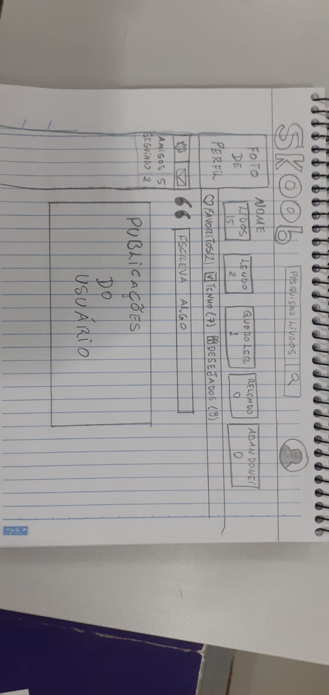
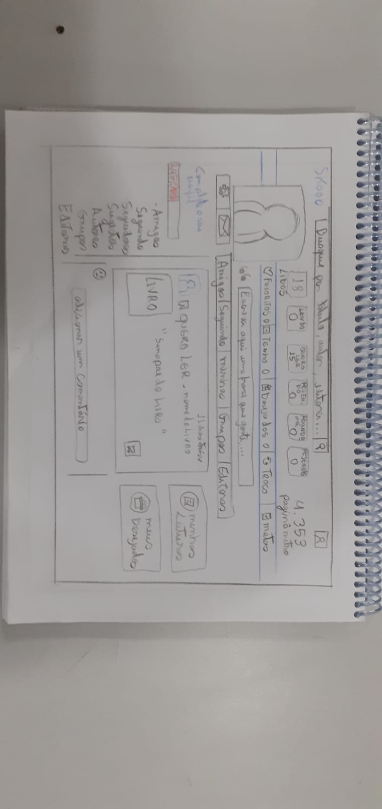

# Planejamento da avaliação - Protótipo de Papel

## 1. Introdução

Elaborar um protótipo de papel é interessante pelo fato que de, muitas vezes, você que trabalha com design acaba gastando muito tempo e esforço para confeccionar um protótipo muito bem elaborado com uma ferramenta dinâmica para prototipagem. Porém ao entregar para os interessados no produto, ocorre de ter que fazer diversas modificações no seu protótipo e evitar retrabalho é sempre o ideal. Segundo (Barbosa, 2021) utilizar o protótipo em papel é um modo rápido e com custos baixos de identificar problemas de usabilidade.

## 2. Objetivo

O objetivo deste documento é planejar de forma detalhadas as tarefas que serão realizadas na avaliação do protótipo de papel do site Skoob.

## 3. Metodologia

A metodologia selecionada após a análise foi a entrevista, utilizando-se dessa técnica, planeja-se que o avaliador instrua o usuário na entrevista para a realização das tarefas, assim como na execução do planejamento. A entrevista ocorrerá presencialmente em um ambiente controlado para que a coleta de dados seja mais rica de informações, nela será disponibilizado para o entrevistado o protótipo em papel.

Também optamos por adotar o framework DECIDE, que propõem orientar o planejamento, a execução e a análise de uma avaliação de IHC. As atividades do framework são interligadas e executadas interativamente, à medida que o avaliador articula os objetivos da avaliação, os dados e recursos disponíveis (Preece et al., 2002).

O acrônimo DECIDE pode ser expandido para os seguintes tópicos:

- **D**: Determinar os objetivos gerais da avaliação e identificar por que e para quem tais objetivos são importantes.
- **E**: Explorar perguntas a serem respondidas com a avaliação.
- **C**: Escolher (Choose) os métodos de avaliação a serem utilizados.
- **I**: Identificar e administrar as questões práticas da avaliação.
- **D**: Decidir como lidar com as questões éticas.
- **E**: Avaliar (Evaluate), interpretar e apresentar os dados.

## 4. Planejamento da Avaliação

### 4.1 Termo de Consentimento

O termo de consentimento é o documento que garante ao participante da pesquisa uma clara noção de como as suas informações serão usadas durante o decorrer do projeto, e também garante ao executores da pesquisa a aceitação clara do participante em fornecer as informações com os fins citados no documento.

### **Termo utilizado pela equipe:**

 

**Termo de Consentimento Livre e Esclarecido**

Os objetivos desta pesquisa, e as informações que serão coletadas, estão relacionados somente com fins educativos, seguindo a Resolução N°466 do Conselho Nacional de Saúde, preservando o participante da pesquisa com todos os seus direitos éticos e humanitários listados na resolução, sempre seguindo os princípios da bioética que engloba os princípios da não maleficência, beneficência, da autonomia e da justiça.   

Os executores da pesquisa podem utilizar a voz, e/ou a imagem do participante caso nescessário, para a coleta de informações e/ou registro de atividades e reuniões, sempre seguindo a Resolução N°466 do Conselho Nacional de Saúde, preservando o participante da pesquisa com todos os seus direitos éticos e humanitários listados na resolução, sempre seguindo os princípios da bioética que engloba os princípios da não maleficência, beneficência, da autonomia e da justiça.    

Ao participar da pesquisa, você deve estar de acordo em fornecer as informações nescessárias para ajudar os executores do projeto 2022.2-Skoob, da matéria de Interação Humano-Computador da Universidade de Brasília, a alcançarem seus objetivos.

  

### 4.2 Protótipo de papel

 Breve demonstração dos protótipos de papel elaborado pela equipe, que será disponibilizado para o usuário durante a entrevista e analisado por ele.

<figcaption align='center'>Imagem 1 - Fonte: Wildemberg Sales, Lucas Lopes </figcaption>
 

<figcaption align='center'>Imagem 2 - Fonte: Wildemberg Sales, Lucas Lopes </figcaption>
 

<figcaption align='center'>Imagem 3 - Fonte: Wildemberg Sales, Lucas Lopes </figcaption>
 

<figcaption align='center'>Imagem 4 - Fonte: Philipe de Sousa </figcaption>
 

<figcaption align='center'>Imagem 5 - Fonte: Philipe de Sousa </figcaption>
 

<iframe width="560" height="315" src="https://www.youtube.com/embed/ET1Iosd1Bt4" title="YouTube video player" frameborder="0" allow="accelerometer; autoplay; clipboard-write; encrypted-media; gyroscope; picture-in-picture" allowfullscreen></iframe>

### 4.3 Entrevista

 O entrevistador e entrevistado iram combinar o melhor momento e forma para a realizar a entrevista, inicialmente ocorrerá via conferência online, porém pode haver mudanças caso seja mais conveniente para o entrevistado, que ela ocorra de outra forma. Para que a entrevista seja objetiva será disponibilizado um guia de perguntas(Tabela 1) para o entrevistador.Vale a pena ressaltar que esse guia de perguntas é apenas uma sugestão, e o entrevistador pode adicionar mais perguntas para agregar à entrevista.

<figcaption align='center'>Tabela 1 - Perguntas da entrevista </figcaption>

|Número|Pergunta|Resposta|
|:----:|:------:|:------:|
|1|Você já havia utilizado a funcionalidade demonstrada no protótipo?| Sim - [  ]   Não - [  ] |
|2|Você conseguiu finalizar a execução da funcionalidade com sucesso? | Sim - [  ]   Não - [  ] |
|3|O que ocorreu para que você não conseguisse finalizar ?|Resposta aberta|
|4|O protótipo em papel, na sua opinião, se mostrou eficaz na realização da tarefa?| Sim - [  ]   Não - [  ] |
|5|Você tem alguma sugestão ou crítica sobre o protótipo de papel?| Resposta aberta |

<figcaption align='center'>Fonte: Philipe de Sousa </figcaption>

## 5. Conclusão

Por fim, após a realização da entrevista e execução do planejamento que foi demonstrado nesse documento, espera-se que os avaliadores realizem as análises seguindo o método selecionado e assim possam produzir os resultados da avaliação do protótipo de papel.

## 6. Referências
 
> BARBOSA, Simone; DINIZ, Bruno. Interação Humano-Computador, Rio de Janeiro, 2021.
> Preece, Jennifer, Rogers, Yvonne, e Sharp, Helen (2002). Interaction Design: Beyond Human-Computer Interaction. John Wiley & Sons.

# Histórico de versão

| Versão |    Data    |             Descrição             |    Autor    |  Revisor   |
| :----: | :--------: | :-------------------------------: | :---------: | :--------: |
|  1.0   | 18/12/2022 | Criação da página do protótipo de papel | Philipe | Hellen |
|  1.1   | 19/12/2022 | Adicionando video protótipo de papel | Philipe | Hellen |
|  1.2   | 20/12/2022 | Adição dos protótipos de papel | Wildemberg Sales, Philipe de Sousa, Lucas Lopes | Hellen |
|  1.3   | 10/01/2023 | Mudança de estilo de entrevista | Wildemberg Sales, Philipe Sousa | Hellen | 

